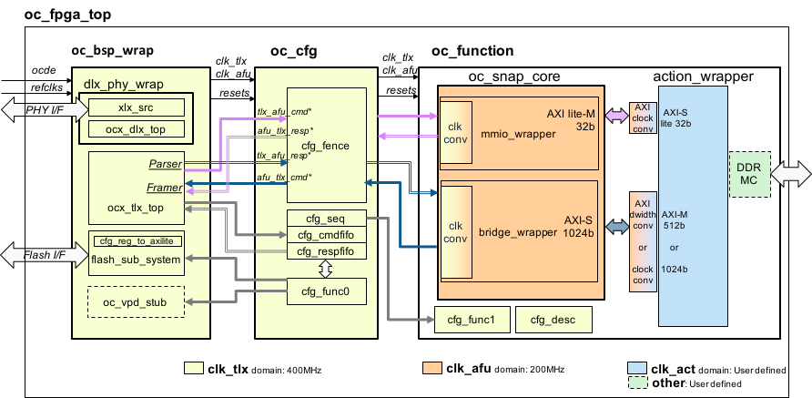

# OC-Accel Hardware

## Diagram and Clock Domain
Here is a more detailed diagram for OC-Accel **Bridge** mode.

* **oc_bsp_wrap** and **oc_cfg** come from oc-bip ( [OpenCAPI3.0 Device Reference design] )
* **oc_function** comes from OC-Accel `hardware/hdl/core`.

[OpenCAPI3.0 Device Reference design]: https://github.com/OpenCAPI/OpenCAPI3.0_Client_RefDesign

It has following clock domains: 

* **clk_tlx**: 400MHz (Don't change)
* **clk_afu**: 200MHz (Adjustable)
* **clk_act**: 200MHz (Adjustable)
* **Other**: Depending on the requirements of peripheral IPs

## AXI4 feature list

Here lists the AXI4 feature list of oc_snap_core: 

### AXI Lite-M

| Signal | Width |
|----| ----|
|ADDR| 32bits|
|DATA| 32bits|

### AXI-S

| Signal | Bit Width | Comment |
|----| ----|---|
| ADDR (AWADDR/ARADDR)| 64 |  Unaligned address supported|
| DATA (WDATA/RDATA)| 1024| |
| ID (AWID/ARID/BID/RID)| 1 to 5 | 2 to 32 AXI IDs |
| USER (AWUSER/ARUSER)| 9 | Support up to 512 PASID (multi-process contexts)|
| SIZE (AWSIZE/ARSIZE) | 3 | All sized transactions from 1 byte to 128bytes are supported|
| BURST (AWBURST/ARBURST) | 2 | INCR |
| RESP (BRESP/RRESP)| 2| OKAY or ERROR |
| WSTRB | 128 |  All patterns are supported |

!!!Note
    Choose less AXI IDs can save the area of snap_core. The AXI ID ports have at least 1 bit. Drive zero if the Action hardware design doesn't use it. 
    
    AXI signals `cache`, `lock`, `qos`, `region` are not supported

!!!Warning
    Burst type "FIXED" is coded in snap_core but hasn't been tested.

## TLx feature list

### TLX to AFU Commands

They are connected to mmio_wrapper.

* **pr_mem_read** (4B, 8B)
* **pr_wr_mem** (4B, 8B)
* **intrp_rdy**

### AFU to TLX Commands

They are connected to bridge_wrapper.

* **assign_actag**
* **rd_wnitc** (128B, 64B)
* **dma_w** (128B, 64B)
* **dma_pr_w** (1B to 32B)
* **rd_pr_wnitc** (1B to 32B)
* **intrp_req**

