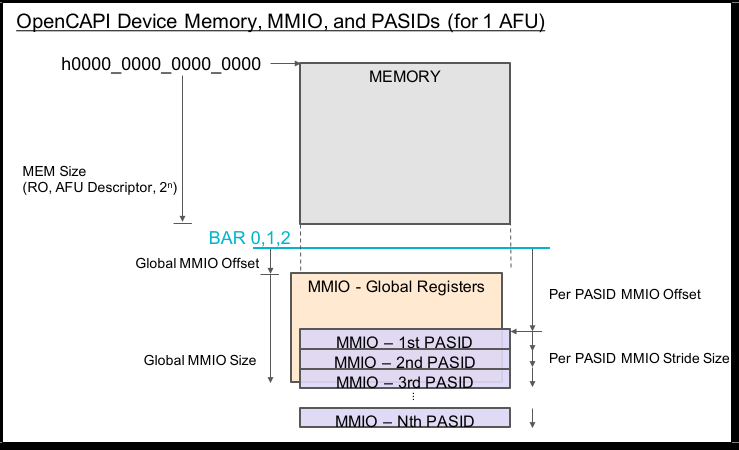
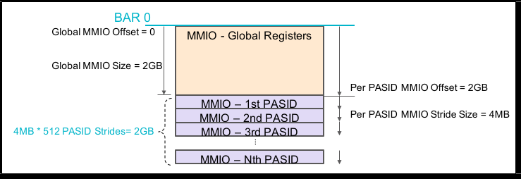
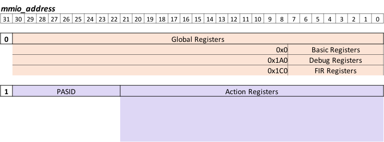

# OC-Accel Registers

Configuration Registers link the software and hardware together. User application software code can use the provided `libosnap` APIs to read and write the registers implemented in FPGA logic, thus configure and control the functions in hardware. Those registers are also called MMIO (memory mapped IO) registers, because they are mapped into a large memory map. The "addresses" of these registers are 64bits wide.

## Memory map
The OpenCAPI3.0 device memory map concepts (BAR, MMIO Global, MMIO Per PASID, and also memory space) are specified with respect to **OpenCAPI configuration space specification**. Here is a conceptual memory map:

 
 
 For OC-Accel: 

 * It only supports 1 AFU
 * It only supports OpenCAPI3.0 C1 mode. MEM_SIZE = 0
 * It supports 512 PASIDs (User Process ID associated with a request)
 * It only uses BAR0
 * Global MMIO Offset = 0, Size = 2GB
 * Per PASID MMIO Offset = 2GB, Stride Size = 4MB
  
So the above memory map is specified to:



The settings can be found in:
```
hardware/oc-bip/config_subsystem/cfg_descriptor.v
```
## Address Layout

OC-Accel registers have two categories: 

* **Global Registers**, 8B, defined in Global MMIO space. Use `snap_global_read/write64()` to access them.
* **Action Registers**, 4B, defined in Per PASID MMIO space. Use `snap_action_read/write32()` to access them. 


The higher 32bits of tlx_afu_cmd_pa (Physical Address) should be matched with BAR0. 

The lower 32bits, also called mmio_address, is processed in OC-Accel. 



# Global Registers: Summary


| mmio_address[30:8] | mmio_address [7:0] | Abbr. | Register Name |
|--------------------|--------------------|-------|---------------|
| 0x0  (Basic)              | 0x00               | IVR   | Implementation Version Register| 
|                    | 0x08               | BDR   | Build Date Register |
|                    | 0x10               | SCR   | SNAP Command Register | 
|                    | 0x18               | SSR   | SNAP Status Register | 
|                    | 0x30               | CAP  | Capacity Register | 
| 0x1A0 (Debug)             | 0x00               | DBG_CLR| Clear Debug Register | 
|                    | 0x08               | CNT_TLX_CMD| Number of TLX Commands | 
|                    | 0x10               | CNT_TLX_RSP| Number of TLX Responses | 
|                    | 0x18               | CNT_TLX_RTY| Number of TLX Retry Responses | 
|                    | 0x20               | CNT_TLX_FAIL| Number of TLX Fail Responses | 
|                    | 0x28               | CNT_TLX_XLP| Number of TLX Translate Pending Responses | 
|                    | 0x30               | CNT_TLX_XLD| Number of TLX Translate Done Responses | 
|                    | 0x38               | CNT_TLX_XLR| Number of TLX Translate Retry Responses | 
|                    | 0x40               | CNT_AXI_CMD| Number of total AXI Commands | 
|                    | 0x48               | CNT_AXI_RSP| Number of total AXI Responses | 
|                    | 0x50               | BUF_CNT    | Counts in data buffers | 
|                    | 0x58               | TRAFIIC_IDLE| No traffic over a period  | 
|                    | 0x60               | TLX_IDLE_LIM| Length of the period for TLX "no traffic"| 
|                    | 0x68               | AXI_IDLE_LIM| Length of the period for AXI "no traffic" | 
| 0x1C0 (FIR)        | 0x00               | FIFO_OVFL | FIFO Overflow Status | 
|                    | 0x08               | FIR_TLX| Errors on TLX interface  | 


!!!Note
    FIR means "Fault Isolation Register". It usually means some errors happened.


# Global Registers: Details
## SNAP Basic Registers
### Implementation Version Register (IVR)

* Offset: 0x00
* POR value depends on source for the build. Example for build based on commit with SHA ID eb43f4d80334d6a127af150345fed12dc5f45b7c and with distance 13 to SNAP Release v1.25.4: 0x0119040D_EB43F4D8

| Bits  |   | Attributes | Description |
|------ |---| ----------- | ----------- |
| 63..40 |  |RO| SNAP Release         |
|  | 63..56 |RO| Major release number |
|  | 55..48 |RO| Intermediate release number |
|  | 47..40 |RO| Minor release number |
| 39..32 |  |RO| Distance of commit to SNAP release |
| 31..0 |  |RO| First eight digits of SHA ID for commit |

### Build Date Register (BDR)

* Offset: 0x08
* POR value depends on build date and time. Example for build on January 12th, 2017 at 15:27: 0x00002017_01121527

| Bits  | Attributes | Description|
|------ |---| -----------|
|63..48 |RO| Reserved
|47.. 0 |RO| BCD coded build date and time
|47..32 |RO| YYYY (year)
|31..24 |RO|  mm   (month)
|23..16 |RO|  dd   (day of month)
|15..08 |RO|  HH   (hour)
|07..00 |RO|  MM   (minute)

### SNAP Command Register (SCR)

* Offset: 0x10
* Send SNAP commands via this register 

| Bits  | Attributes | Description|
|------ |---| -----------|
|63..1 | RO | Reserved |
|0 |WO| soft reset to odma and action_wrapper |

### SNAP Status Register (SSR)

* Offset: 0x18
* Status of snap_core

| Bits  | Attributes | Description|
|------ |---| -----------|
|63..4 |RO| Reserved |
|3 |RO| SNAP fatal error: some bits are asserted in FIR registers|
|2 |RO| SNAP AXI side busy (?)|
|1 |RO| SNAP TLX side busy (?)|
|0 |RO| SNAP idle: Data buffers in snap_core are empty| 


### SNAP Capability Register (CAP)

* Offset: 0x20
* Define the capability of the card

Bitwise definition

| Bits  | Attributes | Description|
|------ |---| -----------|
|63..32 |RO| Reserved|
|31..16 |RO| Size of attached on-card SDRAM in MB|
|15..8  |RO| Reserved|
|7..0   |RO| Card type:|
|||0x31 : AD9V3|
|||0x32 : AD9H7|


## SNAP Debug Registers

* base_addr: 0x1A0

!!!Note
    Subject to change.
### Debug Clear and Debug Counters

DBG_CLR: Clear all of the following debug registers
For following registers: bit[63:32] for Reads, bit [31:0] for Writes.

* CNT_TLX_CMD: Number of TLX Commands  
* CNT_TLX_RSP: Number of TLX Responses  
* CNT_TLX_RTY: Number of TLX Retry Responses  
* CNT_TLX_FAIL: Number of TLX Fail Responses  
* CNT_TLX_XLP: Number of TLX Translate Pending Responses  
* CNT_TLX_XLD: Number of TLX Translate Done Responses  
* CNT_TLX_XLR: Number of TLX Translate Retry Responses  
* CNT_AXI_CMD: Number of total AXI Commands  
* CNT_AXI_RSP: Number of total AXI Responses  
* BUF_CNT: How many entries are valid for Read buffer and Write buffer

### Traffic Idle status
TRAFFIC_IDLE: Used together with TLX_IDLE_LIM and AXI_IDLE_LIM. 

| Bits  | Attributes | Description|
|------ |---| -----------|
|63..6 |RO| Reserved|
|5 |RO| tlx_cmd_idle in a certain number of cycles|
|4 |RO| tlx_rsp_idle in a certain number of cycles|
|3 |RO| axi_cmd_idle (Read) in a certain number of cycles|
|2 |RO| axi_rsp_idle (Read) in a certain number of cycles|
|1 |RO| axi_cmd_idle (Write) in a certain number of cycles|
|0 |RO| axi_rsp_idle (Write) in a certain number of cycles|

## SNAP FIR Registers

* base_addr: 0x1C0

### FIFO Overflow Status (FIFO_OVFL)

* offset: 0x00

| Bits  | Attributes | Description|
|------ |---| -----------|
|63..6 |RO| Reserved|
|7 |RO| fir_fifo_overflow_cmdencw (Write Command Encoder) |
|6 |RO| fir_fifo_overflow_cmdencr (Read Command Encoder)|
|5 |RO| fir_fifo_overflow_cmdcnv (Command Clock Converter)|
|4 |RO| fir_fifo_overflow_rspcnv (Response Clock Converter)|
|3 |RO| fir_fifo_overflow_rspdecw (Write Response Decoder)|
|2 |RO| fir_fifo_overflow_rspdecr (Read Response Decoder)|
|1 |RO| fir_fifo_overflow_dbw (Write Data Buffer)|
|0 |RO| fir_fifo_overflow_dbr (Read Data Buffer)|

### TLX Interface errors (FIR_TLX)

* offset: 0x08
  
| Bits  | Attributes | Description|
|------ |---| -----------|
|63..3 |RO| Reserved|
|3 |RO| fir_tlx_response_unsupport|
|2 |RO| fir_tlx_rsp_err |
|1:0 |RO| fir_tlx_command_credit|


# Action Registers: Summary

mmio_address[30:22] means PASID. That means, the first process opens the OC Device, it will attach PASID=0 when it calls `mmio_action_read/write32()`. Meanwhile, the second process, the third process may attach PASID=1 and PASID=2 when they access the OC Device. Each process has its own "process context", and when OC Device wants to visit the host memory, it has to know which "process context" it belongs to, that means, the OC device needs to send the PASID with its commands. This PASID takes AWUSER or ARUSER as the vehicle to transfer from Action wrapper to snap_core. 

## HDL design

The user can freely define and implement the Action registers if it is written in Verilog/VHDL. However, there are still a registers that are recommended to implement. They are: 


| mmio_address [21:0] | Abbr. | Register Name| 
| ------------------- | --- | --------------| 
| 0x00                | ACR | Action Control Register | 
| 0x04                | IER | Interrupt Enable Register | 
| 0x10                | ATR | Action Type Register |
| 0x14                | AVR | Action Version Register | 
| 0x18                | ISL | Interrupt Handle SRC Address Low | 
| 0x1C                | ISH | Interrupt Handle SRC Address High | 
| 0x30 -> end         |     | Reserved and can be freely used |

### Action Control Register (ACR)

* offset: 0x00
  
| Bits  | Attributes | Description|
|------ |---| -----------|
|31..4 |RO| Reserved|
|3 |RO| Action Ready|
|2 |RO| Action Idle |
|1 |RO| Action Done |
|0 |RW| Write 1 to start Action, Read it to know whether the action has been started|

### Interrupt Enable Register (IER)

* offset: 0x04
  
| Bits  | Attributes | Description|
|------ |---| -----------|
|31..1 |RO| Reserved|
|0 |RW| Enable Interrupt|

### Action Type Register (ATR)

* offset: 0x10 
  
| Bits  | Attributes | Description|
|------ |---| -----------|
|31..0 |RO| Action Type, i.e, 0x10141008|

### Action Version Register (AVR)

* offset: 0x14
  
| Bits  | Attributes | Description|
|------ |---| -----------|
|31..0 |RO| Action Release Version, user defined|

### Interrupt Handle SRC Address Low (ISL)

* offset: 0x18
  
| Bits  | Attributes | Description|
|------ |---| -----------|
|31..0 |RO| Interrupt Handle Source Address Low 32bits |

### Interrupt Handle SRC Address High (ISH)

* offset: 0x1C
  
| Bits  | Attributes | Description|
|------ |---| -----------|
|31..0 |RO| Interrupt Handle Source Address High 32bits |

## HLS design

OC-Accel has already defined the Action Register Layout for HLS Actions.  

| mmio_address [21:0] | Abbr. | Register Name| 
| ------------------- | --- | --------------| 
| 0x00                | ACR | Action Control Register | 
| 0x04                | IER | Global Interrupt Enable Register |
| 0x08                | IIE | IP Interrupt Enable | 
| 0x0C                | IIS | IP Interrupt Status |
| 0x10                | ATR | Action Type Register |
| 0x14                | AVR | Action Release Register |
| 0x18                | ISL | Interrupt Handle SRC Address Low | 
| 0x1C                | ISH | Interrupt Handle SRC Address High | 
| 0x100                 | CONTROL1 | sat + flags + seq |
| 0x104                 | CONTROL2 | Return Code |
| 0x108                 | CONTROL3 | Reserved |
| 0x10C                 | CONTROL4 | Reserved |
| 0x110 - 0x178         |   | Job Data Registers (108 bytes)| 

!!!Note
    0x00 to 0x0C are defined by Xilinx Document UG902.


### Action Control Register (ACR)

* offset: 0x00
  
| Bits  | Attributes | Description|
|------ |---| -----------|
|31..8 |RO| Reserved|
|7 |RW| Auto Restart |
|6..4|RO | Reserved|
|3 |RO| Action Ready|
|2 |RO| Action Idle |
|1 |RO/Clear on Read| Action Done |
|0 |RW/Clear on Read| Start Action|
 
### Global Interrupt Enable (IER)

* offset: 0x04
  
| Bits  | Attributes | Description|
|------ |---| -----------|
|31..1 |RO| Reserved|
|0 |RW| Enable Interrupt|

### IP Interrupt Enable (IIE)

* offset: 0x08
  
| Bits  | Attributes | Description|
|------ |---| -----------|
|31..2 |RO| Reserved|
|1|RW| Interrupt for ap_ready is enabled|
|0 |RW| Interrupt for ap_done is enabled|

### IP Interrupt Status (IIS)

* offset: 0x0C
  
| Bits  | Attributes | Description|
|------ |---| -----------|
|31..2 |RO| Reserved|
|1|RW| Status for ap_ready interrupt|
|0 |RW| Status for ap_done interrupt|

### ATR, AVR, ISL, ISH

These 4 registers have the same definitions as in HDL Action.

* offset: 0x10,  ATR, Action Type Register
* offset: 0x14, AVR, Action Release Register
* offset:  0x18, ISL, Interrupt Handle SRC Address Low 
* offset: 0x1C, ISH, Interrupt Handle SRC Address High 

### HLS CONTROL Registers

4 registers are defined in `actions/include/hls_snap.H`. 
They take the addresses of 0x100, 0x104, 0x108 and 0x10C. 

```
typedef struct {
        snapu8_t sat; // short action type
        snapu8_t flags;
        snapu16_t seq;
        snapu32_t Retc;
        snapu64_t Reserved; // Priv_data
} CONTROL;
```

### HLS Job DATA Registers

0x110 to 0x178 are user defined Job data structure. The size limit is 108 bytes. This is usually defined in `actions/hls_<action_name>/include/<action_name>.h` 
For example:

```
typedef struct helloworld_job {
	struct snap_addr in;	/* input data */
	struct snap_addr out;   /* offset table */
} helloworld_job_t;
```
