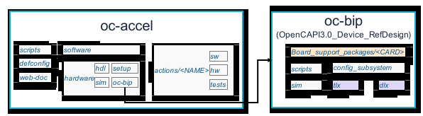
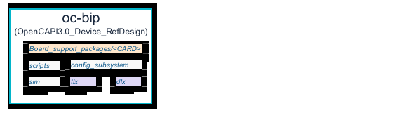
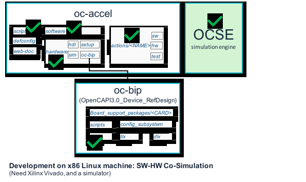
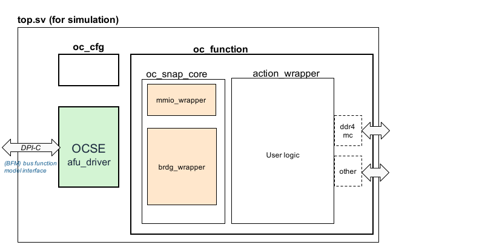
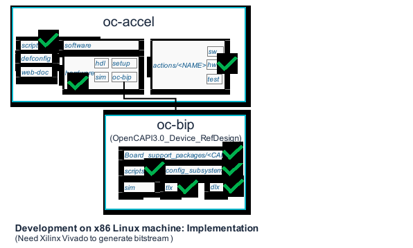
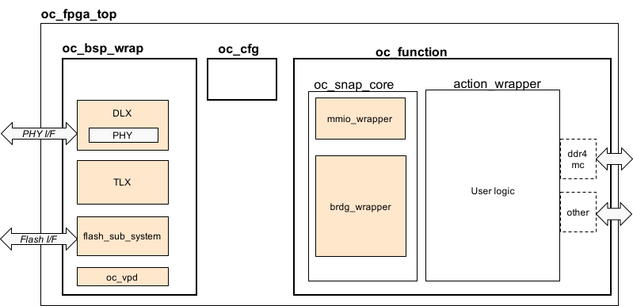
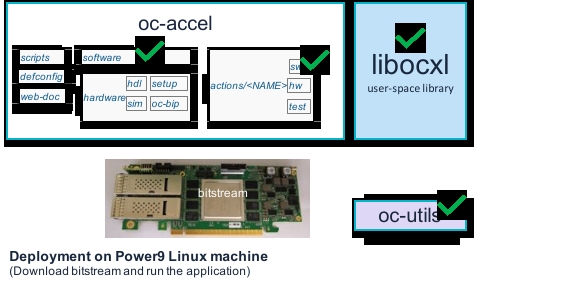

This page introduces the components and files in OC-Accel. For a step-by-step guidance, please start from **User Guide** [Steps in a glance].

[ Steps in a glance ]: ../user-guide/0-steps/

# Repository Structure

The diagram below shows the entire diretory structure of OC-Accel GIT repository. It links to another repository [OpenCAPI3.0_Client_RefDesign] or `oc-bip` which contains the card specific packages and modules to support OpenCAPI protocol.

[ OpenCAPI3.0_Client_RefDesign]: https://github.com/OpenCAPI/OpenCAPI3.0_Client_RefDesign

## Sub directories in oc-accel

The framework has some facilitating components:

* **scripts**: scripts for development environment. It displays a simple user interaction interface to select the card, the application to run (action), simulator, and other options.
* **defconfig**: configuration files for Jenkins regression test (users don't need them.)
* **web-doc**: documentations (this webpage)

It has the modules to bridge OpenCAPI protocol:

* **Software**: provides user library to operate OpenCAPI cards like open_device(), attach_action(), etc. It includes header files and some tools.
* **Hardware**: It has a TLx-to-AXI bridge Verilog design in `hdl`, the scripts to build a Vivado project and run the process in `setup`, the simulation scripts in `sim`, and the link to `oc-bip`.

Then it is the User Application `actions` directory.

* OC-Accel has already provided several examples in **actions** directory, including Verilog/VHDL examples and HLS (High Level Synthesis) examples. When a user wants to create a new Acceleration Application, he or she creates a new directory here.
* Under `actions/<NAME>`, use application also have software part `sw`, hardware part `hw` and test scripts `test`.

## Sub directories in oc-bip

Any card vendor can add their card package support in `oc-bip`. The concept is similar to **DSA** (Device Support Archive) or **BSP** (Board Support Package).

* **Board_support_packages**: Card vendor need to create a separate folder for a new device. It includes:
    1. Constraint files (xdc) to describe the Card pins, flash interface, configurations and so on.
    2. Tcl files to create necessary Vivado IPs.
    3. *Enprypted* Verilog files to use Xilinx high speed serdes IOs.
    4. Verilog files for parameters and FPGA top.
* **config_subsystem**: Shared common logic for OpenCAPI Config.
* **scripts**: to pack the entire `oc-bip` to a Vivado IP (oc_bsp_wrap.xci).
* **sim**: Top Verilog file for simulation.
* **Tlx**: OpenCAPI Device transaction layer reference design.
* **Dlx**: OpenCAPI Device data link layer reference design.

For more information, please refer to [New Board Support].

[New Board Support]: ../deep-dive/board-package/

# Filesets and Hardware Hierarchy

## Files used in Simulation Step

In accelerator development, software and hardware co-simulation is a very important step. The simulation doesn't contain module tlx and dlx, but replies on OCSE to emulate the behavior of host. For more information, please refer to [Co-Simulation].

[OCSE] (OpenCAPI Simulation Engine) is also required. (TODO: update link)

## Top hierarchy in Simulation Step

* **top.sv** is in `oc-bip/sim` directory.
* **oc_cfg** is OpenCAPI Configuration subsystem.
* **oc_function** is the DUT (Design under Test) in this step.
* **oc_snap_core** is in `hardware/hdl`
* User logic **action_wrapper** will be implemented in `actions/<NAME>/hw`
* We use OCSE's DPI-C functions to drive and respond to the bus transactions.

[ Co-Simulation ]: ../user-guide/6-co-simulation/
[ OCSE ]: https://github.com/OpenCAPI/ocse

## Files used in Implementation Step

After co-simulation passed, it's time to do the **Synthesis** and **Implementation** in Vivado. For more information, please refer to [User guide: build image].

[User guide: build image]: ../user-guide/7-build-image/

## Top hierarchy in Implementation Step

To generate a FPGA bitstream (binary image), the top design file is `oc_fpga_top.v`.

* **oc_fpga_top** is located in `hardware/oc-bip/board_support_packeages/<CARD>/Verilog/framework_top`
* **oc_bsp_wrap** includes TLx, Dlx, PHY, Flash subsystem and Card information (VPD). A script `create_oc_bsp.tcl` will assemble these components to a Vivado IP.
* **oc_cfg** is OpenCAPI Configuration subsystem.
* **oc_function** is what we have just simulated and proved that the functions can work correctly.
* **oc_snap_core** is in `hardware/hdl`
* User logic **action_wrapper** will be implemented in `actions/<NAME>/hw`

## Files used in Deployment

When FPGA bit image is generated, use the tool `oc-flash-script` in [oc-utils] (TODO: update link) to download it from Power9 host server to the FPGA flash. After reboot, the bit image takes effect and you can ask application to call FPGA acceleration, with the help of `libosnap` and `libocxl`.

[libocxl] need to be installed. Please follow the README file on its homepage.

Application software and libosnap need to be compiled on Power9 host server also. For more information, please refer to [User-guide: deploy].

[libocxl]: https://github.com/OpenCAPI/libocxl
[oc-utils]: https://github.ibm.com/OC-Enablement/oc-utils/
[User-guide: deploy]: ../user-guide/8-deploy/

