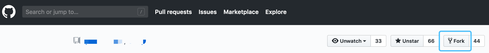
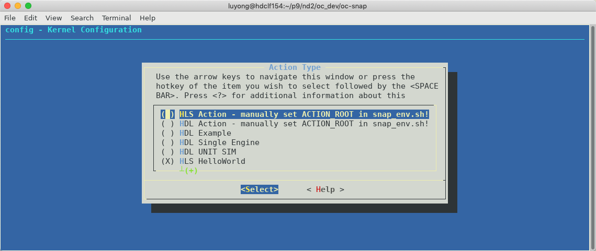
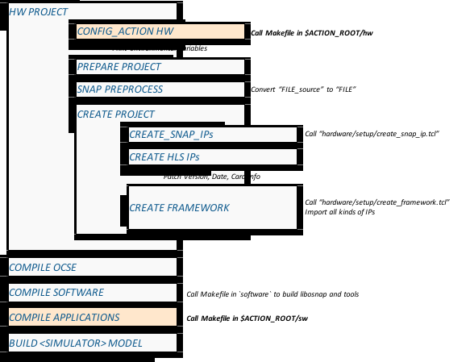

# A new git fork

The first step before creating a new action is to create a git "fork".



Now play on the forked git repository:
```
git clone https://github.com/<MY_NAME>/oc-accel
git submodule init
git submodule update
```

Delete the unnecessary branches, only keep "master", and create your own branches.

When you want to sync with the original repository, do following steps:

```
git remote add upstream https://github.com/ORIGINAL_OWNER/ORIGINAL_REPOSITORY.git
```

Check status:
```
git remote -v
# origin    https://github.com/MY_NAME/MY_FORK.git (fetch)
# origin    https://github.com/MY_NAME/MY_FORK.git (push)
# upstream  https://github.com/ORIGINAL_OWNER/ORIGINAL_REPOSITORY.git (fetch)
# upstream  https://github.com/ORIGINAL_OWNER/ORIGINAL_REPOSITORY.git (push)
```

Do the sync:
```
git fetch upstream
git merge upstream/master
```

When you have some fixes and added some new features, create a pull request from your fork to the original repository. It will be reviewed and then the contribution will be merged.

!!!Note
    OC-Accel encourages people to create their own actions and the links will be recommended on `README.md`. But to keep the repository relatively small and neat, it will not copy every user action design into its original `actions` folder.

    Submit an **issue** or **pull** request to start the discussion.


# A new action

We have several examples as references. Current action example list is:

| Name | Type | Description |
|------|--------|-------------|
|[hdl_example] | VHDL | 512b hdl_example inherited from SNAP1/2. Optional FPGA DDR.|
|[hdl_single_engine] | Verilog | 1024b example to send AXI read/write commands. Used to measure bandwidth and latency. No FPGA DDR.|
|[hls_helloworld] | C/C++(HLS) | 512b example to read data from host, convert to CAPITAL case and write back. No FPGA DDR.|
|[hls_memcopy_1024] | C/C++(HLS) | 1024b example to do memcopy. Enabled FPGA DDR. |


[hdl_example]: ../../actions-doc/hdl_example/
[hdl_single_engine]: ../../actions-doc/hdl_single_engine/
[hls_helloworld]: ../../actions-doc/hls_helloworld/
[hls_memcopy_1024]: ../../actions-doc/hls_memcopy_1024/

According to the action category, copy the folder of a proper example from `actions` and name it.

## Give it a name and type

**Step1:**

```
make snap_config
```
Select `HLS Action - manually set ...` or `HDL Action - manually set ...` in the blue kconfig window.




**Step2:**

Edit `snap_env.sh`, point $ACTION_ROOT to the new action.

``` bash
export ACTION_ROOT=<...path...>/oc-accel/actions/my_new_action
export TIMING_LABLIMIT="-200"
export OCSE_ROOT=<...path...>/ocse
```

**Step3:**

Edit `software/tools/snap_actions.h`, add a row of the new action, with the company/person name, action type ID, and a short description.

``` C
static const struct actions_tab snap_actions[] = {
    { "IBM", 0x10140000, "hdl_example in VHDL  (512b)"                           },
    { "IBM", 0x10140002, "hdl_single_engine in Verilog (1024b)"                  },
    { "IBM", 0x10140004, "UVM test for unit verification (no OCSE and software)" },

    { "IBM", 0x10141001, "HLS Sponge           (512b)"                           },
    { "IBM", 0x10141008, "HLS Hello World      (512b)"                           },
    { "IBM", 0x1014100B, "HLS Memcopy 1024     (1024b)"                          },
};
```

**Step4:**

The Action Type (for example, 0x10140000) should match with following places:

* `actions/<my_new_action>/hw/`
* `actions/<my_new_action>/sw/`

Do a `grep` search and replace them.


## Understand the workflow

Modify the example code (sw, hw and tests) to cook a new action.

Understanding the workflow can help quickly identifying what's wrong. These steps are organized in

* `Makefile`
* `hardware/Makefile`
* `software/Makefile`
* Actions -->
    * `$ACTION_ROOT/hw/Makefile`
    * `$ACTION_ROOT/sw/Makefile`

When adding a new action, before calling the "All-in-one" ocaccel_workflow.py, make sure the make process under $ACTION_ROOT works.
```
cd $ACTION_ROOT/sw
make
cd $ACTION_ROOT/hw
make
```



Above figure shows the steps to make a simulation model. The Action related steps are marked in light orange color. There are also two important tricks:

* **PREPROCESS**: it will deal with the files with "_source" suffix. That means, "FILE_source" will be "pre-processed" and converted to "FILE". "FILE" is a generated one and should not be modified manually, and should not be committed to github either.
* Build Date/Time, Git Version and Card info will be hardcoded into snap_core logic by "**patch_version.sh**"

## Start simulation
After clean up compiling errors in action sw and action hw, kick off a co-simulation by

```
./ocaccel_workflow.py
```

