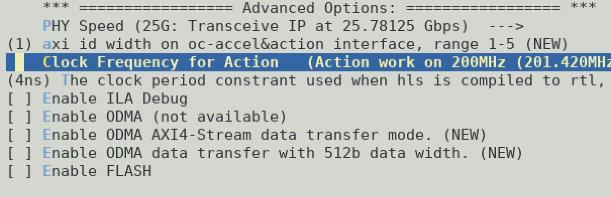

# VHDL/Verilog Action HW Design

Take hdl_single_engine as an example, the top design is **action_wrapper.v**, you need to implement at least

* axi_lite_slave
* axi_master

## axi_lite_slave (Action Registers)

| Signal | Width |
|----| ----|
|ADDR| 32bits|
|DATA| 32bits|

The Action registers can be defined freely. For a single engine inside an action, the lower 22bits of ADDR are available. That means, you can define one million 4B registers inside 4MB range. 

The address definition should match with Action SW header file. For example, 
```
#define REG_SNAP_CONTROL        0x00
#define REG_SNAP_INT_ENABLE     0x04
#define REG_SNAP_ACTION_TYPE    0x10
#define REG_SNAP_ACTION_VERSION 0x14

// User defined below
#define REG_USER_STATUS         0x30
#define REG_USER_CONTROL        0x34
#define REG_USER_MODE           0x38
.....
```

!!!Note
    The User defined Action registers are suggested to start from **0x30**.

    OC-Accel has some pre-defined Action registers in the range of 0x00-0x2F to cooperate with libosnap and software tools. See [Deep Dive: Registers] for more information.


[Deep Dive: Registers]: ../../deep-dive/registers/#action-register-definition

## axi_master (Data Path)

Here lists the supported AXI feature list from **the viewpoint of an Action**. When DATA width is chosen to be 512b, a Xilinx IP "axi_dwidth_converter" (data width converter) will be inserted automatically ([diagram]), and this converter may not support all of the AXI features. (It also costs FPGA resources!)

[diagram]: ../9-migrate/#data-width-change

So we recommend to design a 1024b-wide axi_master and you can use unaligned address and write strobe freely to transfer small sized data. 

Read more in [AXI4 feature list] of snap_core. 

!!!Note
    Choose less AXI IDs can save the area of snap_core. The AXI ID ports have at least 1 bit. Drive zero if the Action hardware design doesn't use it. 

    Please drive zero to AXI signals `cache`, `lock`, `qos`, `region`.

    

[AXI4 feature list]: ../../deep-dive/hardware-logic/#axi4-feature-list


Another reason for 1024b-wide axi_master is to make full use of OpenCAPI bandwidth. When an Action runs at 200MHz, 1024b continuous data transferring can get: 

```
1024b * 200MHz = 200Gb/s = 25GB/s
```

And for 512b-wide action with the same clock frequency only half of the possible bandwidth is utilized. And increasing clock frequency may bring difficulties to get timing closure. 


## Action Clock

The default clock ap_clk (**clock_act**) frequency is 200MHz, same as the clock feeding snap_core (**clock_afu**). 

Currently, `snap_config` menu provides several Action clock choices. 



If a different Action Clock is required, please modify `hardware/hdl/oc_functions.vhd_source` to add a clock generator. The script for this clock generator should be added into `hardware/setup/create_snap_ip.tcl`.

For the clock domain diagram, please read [Clock Domain]. 

[Clock Domain]: ../../deep-dive/hardware-logic/#diagram-and-clock-domain

## Action IPs

Take hdl_single_engine as an example, `actions/hdl_single_engine/hw/Makefile` calls a script `action_config.sh`. 

Many additional steps can be added in this way to construct the Action hw design, for example, create some IPs:

```
echo "                        Call create_action_ip.tcl to generate IPs"
vivado -mode batch -source $ACTION_ROOT/ip/create_action_ip.tcl -notrace -nojournal -tclargs $ACTION_ROOT $FPGACHIP
```

Add action specific IPs into `$ACTION_ROOT/ip/create_action_ip.tcl`. 

After they are generated in the Action HW "make" process, they will be imported into the project by `hardware/setup/create_framework.tcl`:

```
# HDL Action IP
foreach ip_xci [glob -nocomplain -dir $action_ip_dir */*.xci] {
  set ip_name [exec basename $ip_xci .xci]
  puts "                        adding HDL Action IP $ip_name"
  add_files -norecurse $ip_xci -force >> $log_file
  export_ip_user_files -of_objects  [get_files "$ip_xci"] -no_script -sync -force >> $log_file
}

```

OC-Accel has enabled one channel of DDR memory controller for AD9V3 card. Take hdl_example (VHDL) and enable "DDR" in the KConfig menu. It will ask `hardware/setup/create_snap_ip.tcl` to generate the required memory controller and simulation model and `create_framework.tcl` will integrate it. 

Any other peripheral IPs can be generated similarly. 

!!!Note
    Whether to enable a peripheral IP depends on the user case and also depends on the FPGA card. Putting the IP creation script in `create_snap_ip.tcl` or `create_action_ip.tcl` are both fine.


## Action Tcls

`hardware/setup/create_framework.tcl` will also parse `$ACTION_ROOT/hw/tcl` folder to execute Action tcl scripts.

```
# Action Specific tcl
if { [file exists $action_tcl] == 1 } {
  set tcl_exists [exec find $action_tcl -name *.tcl]
  if { $tcl_exists != "" } {
    foreach tcl_file [glob -nocomplain -dir $action_tcl *.tcl] {
      set tcl_file_name [exec basename $tcl_file]
      puts "                        sourcing $tcl_file_name"
      source $tcl_file
    }
  }
}

```


## Unit Verification

Unit verification is optional and depends on the developers. Co-simulation with OCSE is a good way to verify the correctness, but developers can also build their own unit verification environment to enable more advanced verification tools and methodologies like UVM. Developers and apply more stress random tests and coverage harvest to assure the design quality. 

# VHDL/Verilog Action SW Design

The steps include:

* snap_card_alloc_dev()
* snap_attach_action()
* Main body: ACTION registers interaction with hardware
* snap_detach_action()
* snap_card_free()


About "main body" there are a lot of area to explore here. Two APIs are used to read and write Action registers: 

* snap_action_read32()
* snap_action_write32()


Multiple-process **TODO**: read Examples: hdl_multple_engine


