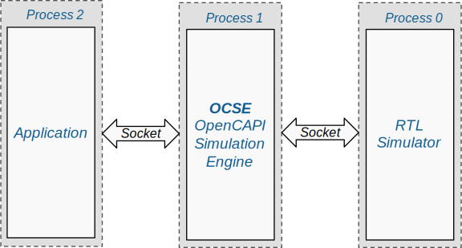

# Overview of Co-Simulation

Co-Simulation lets you run the software (application on the host) together with the hardware (acceleration logic on the FPGA) simulated by functional simulators from either Xilinx Vivado (`xsim`) or other EDA vendors such as Cadence Xcelium (`xrun`), Synopsys VCS (`vcs`), etc.

!!!Note 
    All-in-one script `ocaccel_workflow.py` supports Xilinx Vivado `xsim` and Cadence Xcelium `xrun`. 
    
    It's possible to let `make model` and `make sim` flow to support a wider range of simulators. 

With co-simulation, the functional correctness of your acceleration can be verified with all pieces including software and hardware before you have a real FPGA card to program.

Co-simulation in OpenCAPI acceleration framework consists of three processes as shown in the picture below:

* Process 0 runs RTL simulator for simulating logic behavior of FPGA design
* Process 1 runs OCSE (OpenCAPI Simulation Engine)
* Process 2 runs user application.
  
The three processes are communicated via sockets.



During the simulation, the user application is exactly the one that will be ran on a real Power9 system, that is to say, for the software designer, co-simulation provides exactly the same behavior as if they are running on a real system with a real FPGA card. In this way, OCSE acts as the proxy to intercept OpenCAPI related requests from user application and re-route them to the RTL simulator, vice versa.

The file structure and module level hierarchy is covered in [top hierarchy in simulation step].

[top hierarchy in simulation step]: ../../repository/#top-hierarchy-in-simulation-step

# Start Co-Simulation

The basic flow of running co-simulation has been covered in [simulation section of running helloworld]. Please refer to it for a quick getting started.

[simulation section of running helloworld]: ../../user-guide/2-run-helloworld/#simulation  

To start the co-simulation, the simplest way is to use `ocaccel_workflow.py` with its rich command line options.

For example, run co-simulation with cadence xcelium where the user application is `snap_helloworld`:

```
./ocaccel_workflow.py -o <path to ocse> -s xcelium -t "snap_helloworld <command line options of snap_helloworld>"
```
!!!Note
    In the `-t` options, `ocaccel_workflow.py` searches `actions/<your action>/sw` for the availability of command executable (`snap_helloworld` in above example). If the command you are going to run is not in `actions/<your action>/sw`, please specify the absolute path. 

or, run co-simulation with vivado xsim without specifying the user application:

```
./ocaccel_workflow.py -o <path to ocse> -s xsim
```

If the user application is not specified, an `xterm` will pop up after co-simulation startup. In the `xterm`, user is expected to run any application they want as if they were running on a real POWER system with an OpenCAPI enabled FPGA card.  

!!!Note
    In the popped up `xterm`, by default the path of the current working directory is where the simulation starts (the [simout] path). For any command that will trigger access to FPGA card, it should be ran in this [simout] path, otherwise the attempt of running any of these commands would fail.

# Check the Simulation Result

## Running with `-t` option

If the test is running with `-t` options, the basic simulation result (`PASS` or `FAIL`) of each simulation is shown after running the `ocaccel_workflow.py` script. The result is deduced by looking at the return code of the command specified in the `-t` option. If the return code is `0`, the simulation is treated as `PASSED`, otherwise, it is `FAILED`. 
!!! Warning
    If there are fatal errors encountered in the RTL simulator or OCSE during simulation, the simulation result will be treated as `FAILED` regardless of the result of user application, aka, the command specified in `-t` option.

## Running without `-t` option
If the test is running without `-t` option, i.e., running with `xterm`. Since it is hard to track user behaviors in the xterm (users are expected to run multiple commands with and/or without OpenCAPI traffics), the simulation result is determined by the user themselves.

## Simulation Output Path
[simout]: ../../user-guide/6-co-simulation/#simulation-output-path
Each simulation has a `simout` path structure as below:

```
<...>/hardware/sim/<simulator>/<timestamp>.<rand_num>
```

For example, if xcelium is used, we have the following directory as the simulation output:
```
<...>/hardware/sim/xcelium/1568471461533.1648652400
```

All of the simulation related logs, files and waveforms can be found in the `simout` directory.

After each simulation, a soft link named as `latest` will be created pointing to the `simout` of the latest simulation.

## Check the Waveform

By default, `ocaccel_workflow.py` enables waveform dumping. The waveform can be found in the following directory:

For Vivado `xsim`:
```
<...>/hardware/sim/xsim/<timestamp>.<rand_num>/top.wdb
```

For Cadence `xcelium`:
```
<...>/hardware/sim/xcelium/timestamp>.<rand_num>/capiWave/
```

To control the simulator specific waveform dumping options (written in tcl), please edit the following files:

For Vivado `xsim`:
```
<...>/hardware/sim/xsaet.tcl
```

For Cadence `xcelium`:
```
<...>/hardware/sim/ncaet.tcl
```

To disable the waveform dumping, use the following command options in `ocaccel_workflow.py`:
```
./ocaccel_workflow.py --no_wave
```

## Recompile for small design changes

If you have modified the design just a little bit (no file name and hierarchy changed), you can just simply rerun the compile script under: 

```
<...>/hardware/sim/xsim/top.sh
```

or 
```
<...>/hardware/sim/xcelium/top.sh
```

The simulation will be rebuilt and just run `./run_sim` to start the xterm window. It can save time to debug your logic.


!!!Warning
    Be aware of the files having "**_source**" suffixes. If you need to change "FILE", please make the modifications on "FILE_source", then do following: 

    `rm -f FILE`

    `cd <...>/hardware`

    `make snap_preprocess_execute`

    So "FILE" will be regenerated from "FILE_source".


However, if your design change is big, you should still start from `./ocaccel_workflow.py`.

